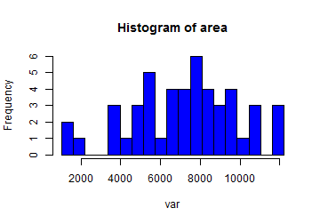

---
title       : Exploring Datasets
subtitle    : Shiny app for coursera DDP Course Project
author      : Ariel
job         : 
framework   : io2012        # {io2012, html5slides, shower, dzslides, ...}
highlighter : highlight.js  # {highlight.js, prettify, highlight}
hitheme     : tomorrow      # 
widgets     : [mathjax, quiz, bootstrap]            # {mathjax, quiz, bootstrap}
mode        : selfcontained # {standalone, draft}
knit        : slidify::knit2slides
---class:class1
<style>
      body{
      background-color: rgb(100, 250, 180);
      }
      .class1{
      background-color: rgb(100, 200, 100);
      }
      h1{
      color:yellow;
      }
      #text{
      color:yellow;
      }
      #note{
      color:magenta;
      }
</style>

## Shiny app: "Exploring Datasets"
<br>
<br>
<h1> Main purpose </h1> <br>
<p id="text"> To make a very basic exploration of some R datasets.</p>
<br>
<br>
<br>
<h1> Links </h1>
<a id="text" href="https://ariel-hh.shinyapps.io/exploring_datasets/">The app in Rstudio's servers.</a> <br>
<a id="text" href="https://github.com/Ariel-HH/DDP-coursera">The app code in github.</a>

--- class:class1
## Select Dataset
<br>
<br>
<p id="text"> You can select among the following datasets:</p>
<br>

```r
c("rock", "pressure", "cars", "mtcars", "iris")
```

```
[1] "rock"     "pressure" "cars"     "mtcars"   "iris"    
```


--- class:class1
## Select how many obs to see
<br>
<p id="text"> You can select how many obs to see. For example, the default values of the app will show the same 
output as the following code:</p>

```r
head(rock)
```

```
  area    peri     shape perm
1 4990 2791.90 0.0903296  6.3
2 7002 3892.60 0.1486220  6.3
3 7558 3930.66 0.1833120  6.3
4 7352 3869.32 0.1170630  6.3
5 7943 3948.54 0.1224170 17.1
6 7979 4010.15 0.1670450 17.1
```


--- class:class1
## Select variable for histogram (and number of bins) 
<p id="text"> Finally, you can select a variable from the dataset to see a histogram, and determine the bins in the histogram. The default values in the app will show the same output as the following code:</p>

```r
var <- rock$area
hist(var, breaks = seq(min(var), max(var), length.out = 20), 
                 main ="Histogram of area", col = "blue")
```


<p id="note"> <font size="-0,5"><strong>Note: This part (selecting the variable) is actually the motivation for the app, because it was far from obvious to me how to do it. Take into account that the options are available only after choosing the dataset.</strong></font></p>


